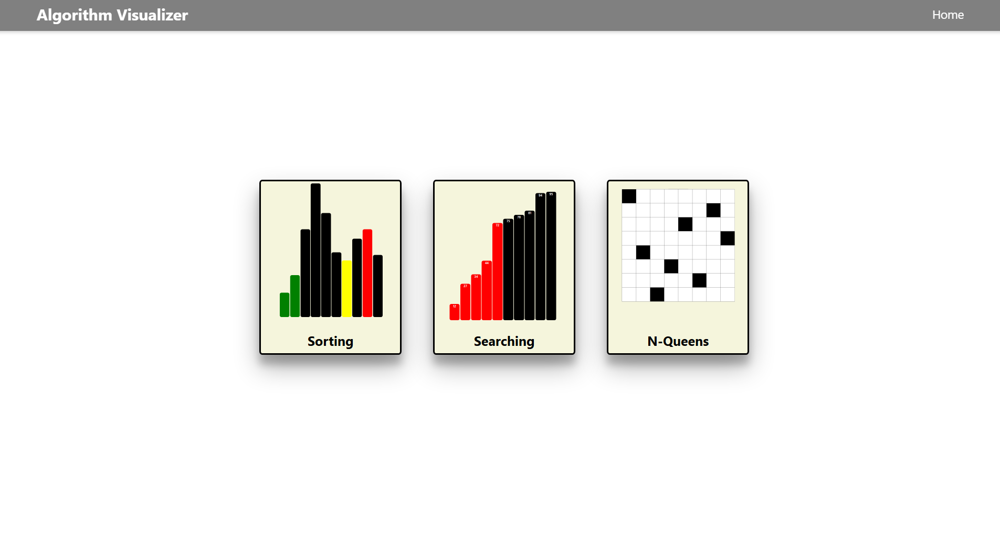
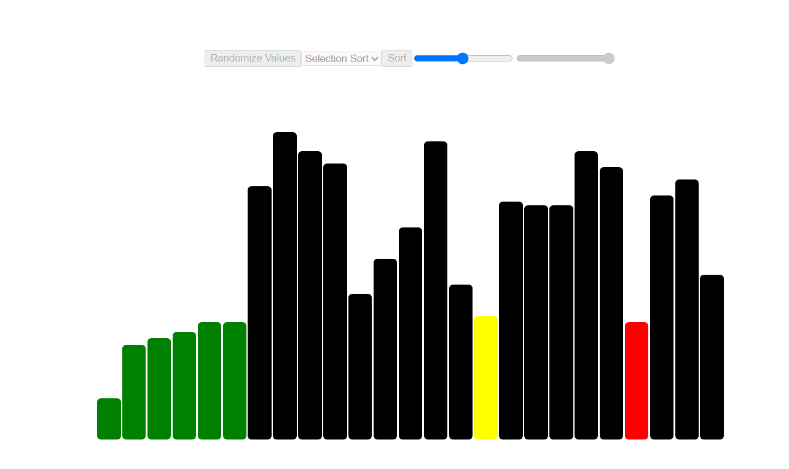
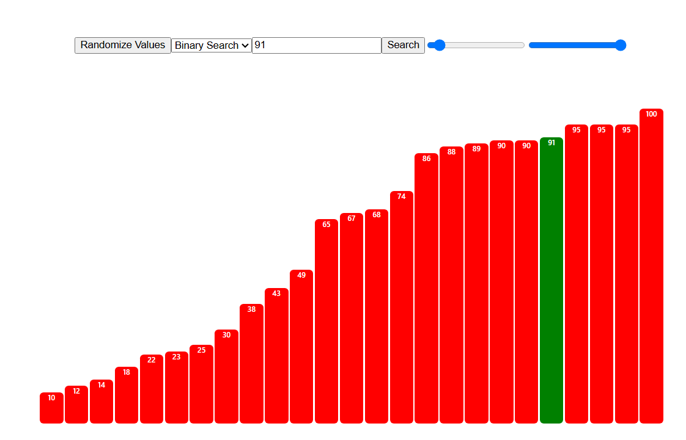
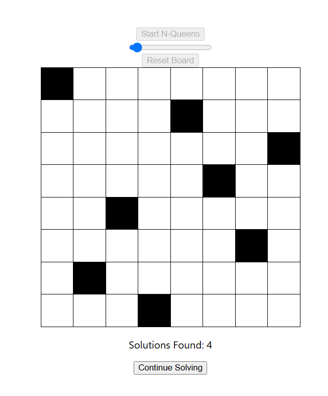

# Algorithm Visualizer

### This algorithm visualizer is a ninteractive web applicated designed to help entry-level CS students understand and visualize various algorithms in action. Built with React, this tool provides intuitive animations and controls, making algorithms more accessible and engaging.

## How to Use

### 1. Select one of the algorithm categories in the home screen

### 2. Depending on the category, there will be various controls to help interact with the algorithm. This various from the algorithm selection to things like speed and amount of values.

### 3. Have fun!

## Gallery

## How to install

### 1. Clone this repository.

### 2. Ensure that you have Node.js and npm installed on your machine.

### 3. Run npm install.

### 4. Run npm start to start the application.

### 5. Open http://localhost:3000 in your brower to view the app!

## Made by Aidan McHugh
